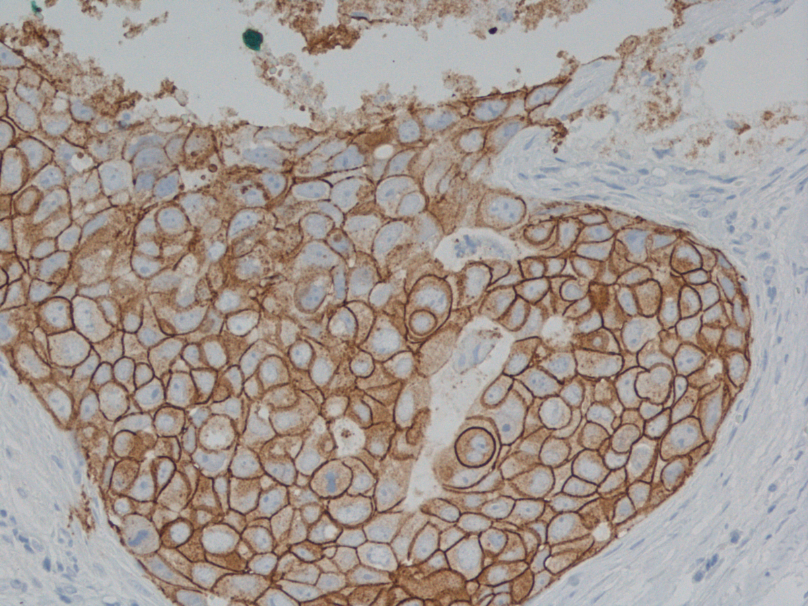
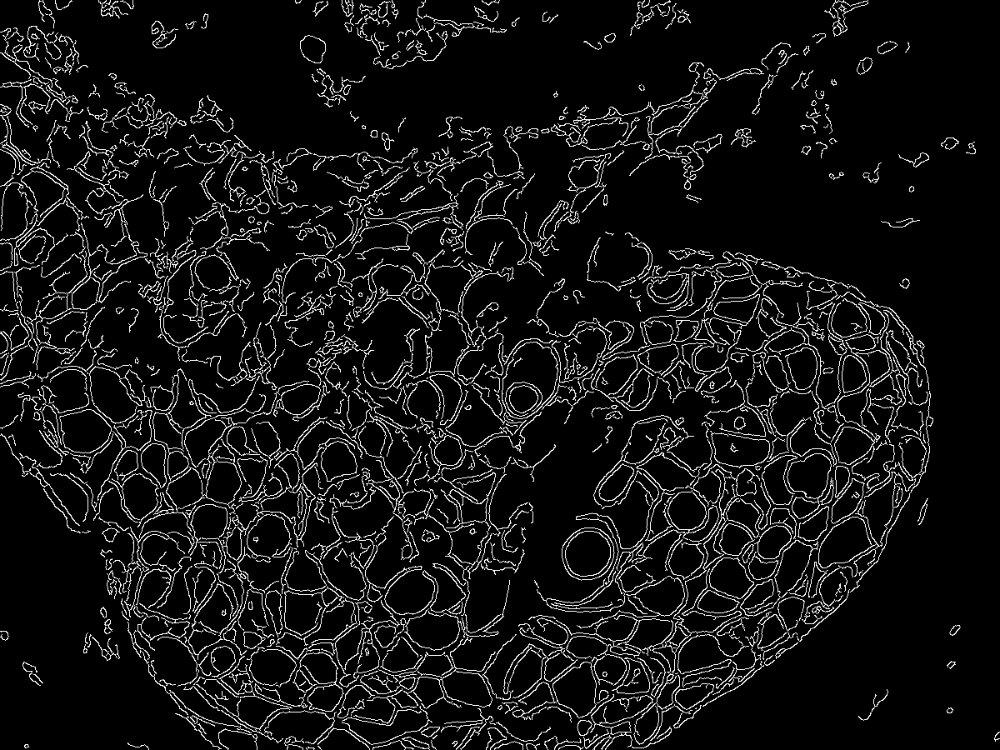
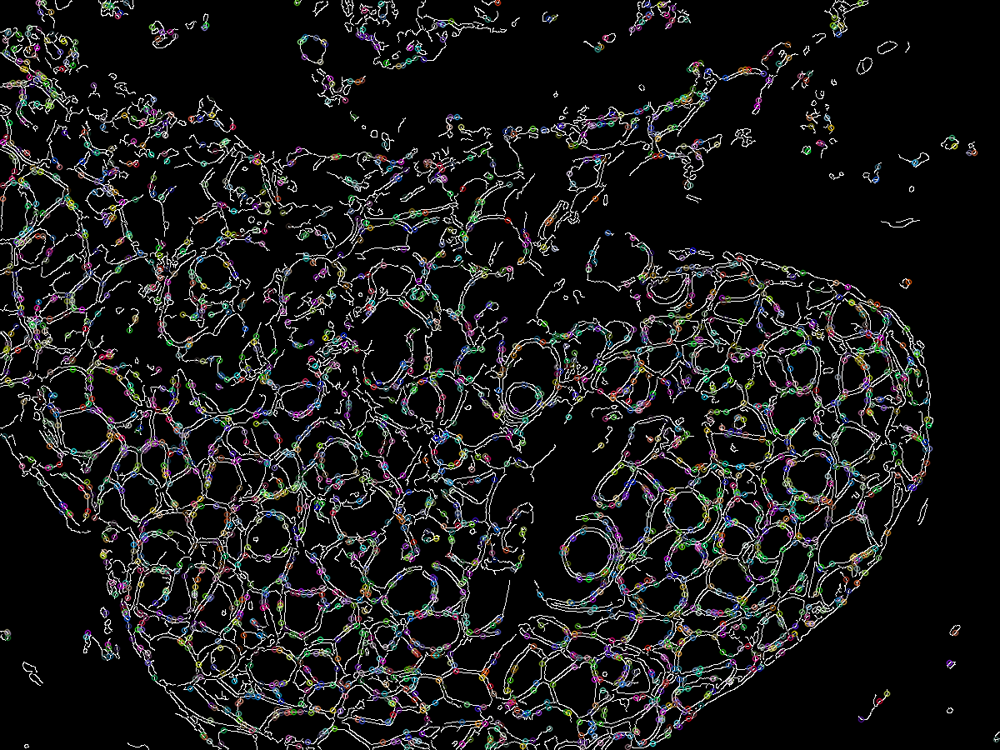

# Cell Detection and Region Extraction
## Project for the course "Algorithms and Data Structures" at Wrocław University of Science and Technology

This program processes microscopic tissue images and detects individual cells on them. It utilizes the Canny algorithm to detect edges and the AGAST detector to find key points. Only the points located on the detected edges are further processed. The obtained points form the vertices of a planar graph called the "Relative Neighborhood Graph." After building the graph according to its rules, face detection is performed. By traversing all edges in both clockwise and counterclockwise directions, a set of all graph simple cycles is generated, which approximately corresponds to the cells present in the input image.

## Dependencies

- OpenCV v4.7.0
- JGraphT v1.5.2

Please make sure to install the above libraries before running the program.

## Usage

1. Provide the input tissue image to the program. The image should be located in the `img` folder as 'input.png'. The image size should be matching your monitor size.
2. Set the desired parameters in the `Main.java` file.
3. The program will apply the Canny algorithm to detect edges on the image.
4. It will then use the AGAST detector to find key points, considering only the points located on the detected edges.
5. The obtained points will be used to construct a graph following the rules of the Relative Neighborhood Graph.
6. Finally, the program will perform region detection by traversing all edges in both clockwise and counterclockwise directions to generate a set of all graph regions, approximating the cells present in the image.

## Examples

Sample images are provided in the `img/HER2` folder. The following images are an example of the program's output:

